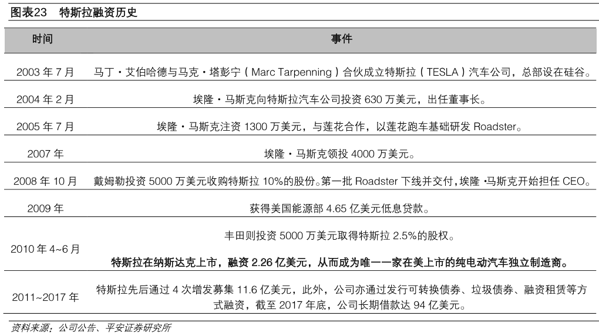

# 行业及代表公司发展历史
## 特斯拉发展历史
特斯拉汽车公司成立于 2003 年 7 月 1 日，公司研发、生产和销售高性能的纯
电动车、太阳能发电以及储能系统，并提供维护、安装、运营以及其他的相关服务，
致力于实现推动全球向可持续能源转变的目标。与其他竞争对手不同，公司采用纯
电动化和垂直一体化的战略，按照典型科技产品生命周期的逻辑去打造一款汽车。
此外，公司采用线上销售和线下自营店直销的模式。截止 2018 年第三季度，全球
已有 45 万特斯拉车主。
## 特斯拉融资历史

`
来源： 平安证券研究所, 2019-03-26
`

## [特斯拉近几年产销数据](https://en.wikipedia.org/wiki/Tesla,_Inc.)

## 特斯拉主要一级国际供应商
|产品|供应商|
|---|---|
|电池（Cell 和 Module）| 松下|
|正极材料 |住友化学|
|负极材料 |日立化成|
|隔膜 |住友化学|
|电解液 |三菱化学|
|集成电路 |意法半导体|
|电池接触器 |泰科电子|
|电池冷却泵 |德纳 DANA|
|BMS| 特斯拉|
|冷却液 |意大利高华|
|视觉运算处理器 |英伟达|
|天线射频 |AT&T|
|毫米波雷达| 博世|
|空调系统 |汉拿伟世通|
|电池冷却系统 |Modine 摩丁|
|电机控制器 |特斯拉|
|轮胎 |米其林|
|座椅 |Futuris|
|保险杠总成 |摩缇马帝 Multimatic|

## 涉及特斯拉供应链 A 股上市公司

|供应商|产品|
|---|---|
|旭升股份|精密铝合金汽车零部件，产品包括变速箱箱体、电动机、变速箱悬挂、电池组外壳、箱体、冷却系统组件、电子元件保护外壳和液压油泵|
|三花智控 |汽车空调和热管理系统零部件，包括膨胀阀、水冷版、油冷器和油泵|
|文灿股份 |铝合金车身结构件|
|宏发股份 |高压直流继电器|
|拓普集团 |轻量化铝合金底盘结构件|
|奥特佳 |为特斯拉公司的某型号电动汽车供应汽车空调产品（HVAC）|
|鸿特科技|公司从事铝合金压铸业务，已通过特斯拉合格供应商的资格认证，但尚未为其生产相关产品|
|赣锋锂业 |向特斯拉指定电池供货商提供氢氧化锂产品|
|万丰奥威|提供镁合金部件，包括主要包括仪表盘骨架、动力总成件、前端载体、支架类、后提升门内板、方向盘、座椅等汽车部件|
|中科三环 |钕铁硼磁体|
|永利股份|公司下属子公司为特斯拉提供电池模组配件，开发设计模具并注塑生产电池模组配件，大部分产品直接供应给特斯拉，小部分供货给其他客户进行组装后销售给特斯拉。|
|申达股份 |汽车内饰业务|
|横店东磁 |与特斯拉在磁性材料方面合作，另有处于开发阶段的项目|
|联创电子 |车内监控、前视 ADAS、盲区监控等镜头|
|激智科技 |光学膜产品|
|四维图新 |导航地图提供商|
|长盛轴承 |自润滑轴承产品|
|宜安科技 |汽车轻量化材料|
|先导智能 |锂电池卷绕机|
|五洲新春 |拟并购标的新龙实业是国内的汽车空调管路和家用空调管路领域内知名供应商，为特斯拉二级供应商|
|天汽模 |汽车模具|
|华工科技 |新能源汽车空调加热与动力电池的热管理系统传感器|
|宁波华翔 |旗下公司劳伦斯集团提供豪华汽车内饰件|
|中鼎股份 |提供新能源车型电池冷却系统密封类产品|
|长信科技 |汽车屏|
|科达利 |锂电池结构件|
|广东鸿图 |支架类零部件|
|东山精密 |FPC、LED 器件、LCM 模组、触控面板、精密钣金、精密铸造产品等|
|安洁科技 |金属精密结构件|
|通富微电 |电源管理类电子产品封测|
|云海金属 |供少量镁合金给特斯拉的一级供应商|

# [中国新能源汽车政策历史](https://wenku.baidu.com/view/20d8753aa45177232e60a243.html)

# 主要技术领域
## 动力电池
## 电机
## 电控系统
## 充电设施
## 整车制造
[同济大学专题报告—《燃料电池汽车动力总成方案分析》](http://www.xnyauto.com/news/201902/31654.html)

