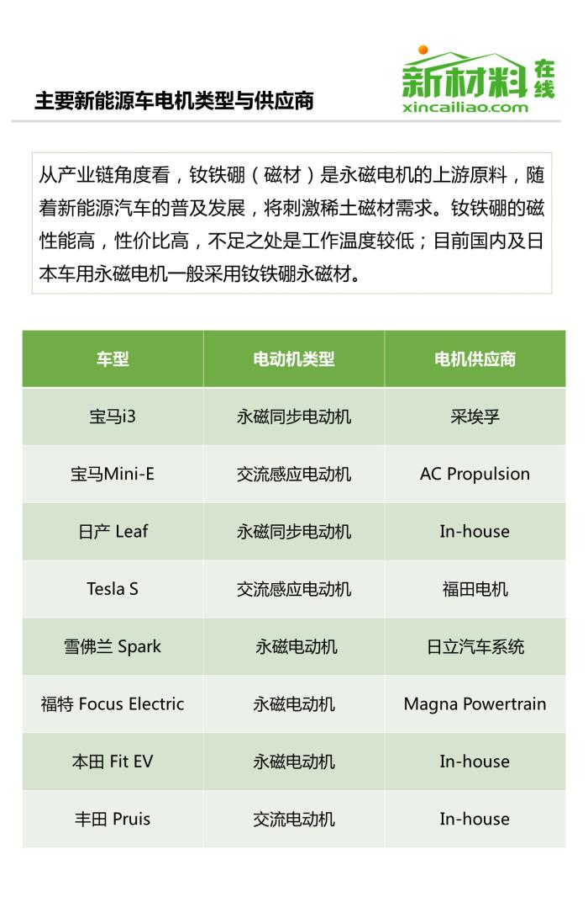
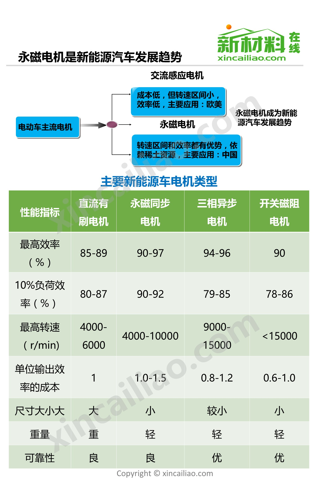
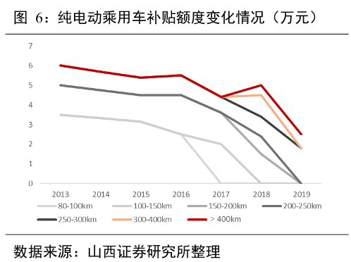

# 新能源电动汽车行业分析----从特斯拉，比亚迪，蔚来着手

[TOC]

## 中国新能源汽车产业， 比亚迪电动汽车和蔚来汽车发展简史
见 [电动汽车政策和比亚迪蔚来发展史](1-大环境与商业网络/电动汽车政策和比亚迪蔚来发展史.numbers)

## 特斯拉的发展历程
|时间|事件|
|---|---|
|2003|公司成立|
|2004-02|Elon Musk 向特斯拉投资 630 万美元，出任董事长|
|2005-07|Elon Musk 注资 1300 万美元，与莲花合作，以莲花中国为基础研发 Roadster|
|2007|Elon Must 领投 4000 万美元|
|2008-10|戴姆勒投资 5000 万美元获 10% 股权， Roadster 量产|
|2009|获得美国能源部 4.65 亿美元低息贷款|
|2010-04|丰田投资 5000 万美元获得 2.5% 股权|
|2010-06|IPO, 融资 2.26 亿美元|
|2012|Model S 量产|
|2015|Model X 量产, Model S 累计销量突破 10 万|
|2016|Model S 累计销量突破 15 万， Model X 成全球最畅销插电式汽车, Model 3 发布|
|2017|Model 3 量产, Semi 卡车和 Roadster2 发布|
|2018|6月底, Model 3 周产量突破 5000 辆|
|2019|预计 Model Y 上半年发布|

## 观点
如果说特斯拉是 CTO JB Straubel 看到了电动车的商业化前景而创立的， 再由 Elon Musk 加持而发展起来的， 那比亚迪则是一个合格的利用中国产业政策的跟随者， 而蔚来只是一个资本驱动的投机者。 

## 中外主要技术差距
### 总体现状： 
三项核心技术， 电池， 电机， 电控。
电池和电控上还存在较大的差距， 电机上差距较小。
从特斯拉的国内供应商提供的材料和产品来看， 也是如此。

#### 电池
|公司|电池类型|正极材料|特点|单体能量密度|售价|
|---|---|---|---|---|---|
|松下|圆柱|高镍三元, NCA(镍钴铝锂)|能量密度大，工艺成熟，良品率高|250 ～ 300Wh/Kg|178美元/KWh(Model3)|
|LG |软包|三元 NCM(镍钴锰锂)|安全性能高，重量轻，内阻小，一致性差，成本高，技术门槛高|230 ～ 250Wh/Kg|205 美元/KWh(Bolt)|
|三星|方形|三元 NCM, NCA|单体容量大，一致性差，能量密度低|210 ～ 230Wh/Kg|---|
|宁德时代|方形|三元 NCM， 磷酸铁锂|单体容量大，一致性差，能量密度低|190 ～ 240Wh/Kg|1410 元/KWh|
比亚迪以磷酸铁锂为主，和宁德时代差不多， 可以看出， 国内在单体能量密度上还有差距， 价格上也无优势， 不过已经在发展三元材料， 希望后续能追上差距

#### 电机
按类型分为多类

由于我国具有稀土资源优势，生产的主流电机为永磁同步电动机，在技术方面和日韩国家接近，而相较于欧美国家的交流异步电机，则具有尺寸小、质量轻的优势

#### 电控
在电控技术发展领域，IGBT，即绝缘栅双极型晶体管的发展对于电控技术的突破和电控成本的降低极为关键。但是纵观全球市场的竞争格局，欧美国家在IGBT的技术上，有着绝对的优势，在功率分立器件和功率IC方面都做得极好，而日本企业在功率IC方面不如欧美国家，但是分立功率器件方面做得较好。而中国由于企业研发起步晚，在IGBT的研发方面和欧美和日本的技术差距较大

## 对外收购与投资行为
### 特斯拉主要收购行为
|公司|领域|收购时间|收购金额|
|---|---|---|---|
|Riviera Tool LLC|a manufacturer of stamping die systems used to form sheet metal parts, 冲压模具制造商|2015-05-08|未知|
|SolarCity|provides solar energy services to homeowners, businesses, government, and non-profit organizations, 太阳能服务供应商|2016-06-22|26 亿美元|
|Grohmann Engineering|German engineering company based in Prüm 德国普鲁姆的一家工程公司|2016-11|1.35 亿美元|
|Perbix|designs automated manufacturing equipment, 设计自动装配设备|2017-11-07|10.5 亿美元|
|Maxwell Technologies|manufactures and markets energy storage and power delivery solutions for automobiles, 生产汽车储能设备， 提供电力输送解决方案|2019-02-09|2.18 亿美元|

### 比亚迪
2003 年收购秦川汽车从电池行业进军汽车行业
2009 年收购湖南美的客车制造有限公司， 资质上具备了制造电动大巴的能力
### 蔚来汽车采用与江淮汽车合作， 由江淮代工生产， 李斌的蔚来资本倒是进行了不少的投资
|公司|介绍|时间|金额|领域|
|---|---|---|---|---|
|容百科技|国际领先的动力电池正极材料制造商|||先进制造|
|康德复材|新能源汽车碳纤维轻量化整体解决方案|||先进制造|
|联赢激光|中国激光焊接设备知名品牌|||先进制造|
|易骑换电|新能源两轮电动车共享充电、换电服务商|2019-04-04||电动汽车及核心零件|
|嬴彻科技|研发自动驾驶，智能新能源技术和物流大数据智能重卡车|||电动汽车及核心零件|
|富特科技|一流的新能源汽车核心零部件供应商|||电动汽车及核心零件|
|奥动新能源|新能源汽车换电技术和解决方案提供方|||新能源及能源互联网|
|主线科技|卓越的智能驾驶解决方案与服务提供商|2018-11-08||自动驾驶及智能化服务|
|Innovusion|打造可靠高效的自动驾驶感知系统|2018-11-08||自动驾驶及智能化服务|
|小马智行|旨在为全球提供最先进、最安全、最可靠的自动驾驶技术|||自动驾驶及智能化服务|
|黑芝麻|视觉感知核心技术开发与应用提供商|||自动驾驶及智能化服务|
|Momenta|打造自动驾驶大脑，提供安全可量产的自动驾驶解决方案|||自动驾驶及智能化服务|
|四维智联|为用户提供“共商”、“共建”、“共享”的车联网整体解决方案|2018-10-30||车联网及出行服务|
|爱泊车|AI智慧泊车大数据运营平台|||车联网及出行服务|
|车联天下|车载智能终端和车联网服务平台|||车联网及出行服务|
|嘀嗒出行|共享经济的大众出行平台|||车联网及出行服务|
|首汽约车|以高品质网约车为核心的一站式移动出行平台|||车联网及出行服务|
|有车出行|主打新能源汽车的O2O租赁服务平台|||车联网及出行服务|

### 观点
1. 特斯拉不用担心外国技术的封锁， 能借用外力时借用外力， 不论是技术还是资本， 在自己的核心技术和产品上迭代， 待实力起来后， 再收购或者发展相关技术。

2. 比亚迪这可怜孩子， 什么都得自己搞， 虽然可能在技术上与国际先进水平还有差距， 有的差距还不小， 但也是有自己真正的能力的。

3. 蔚来看起来是不仅想有产品， 还想基于产品把下游的相关服务也给做了， 但就那么点钱， 即使做了那么些收购， 也只是重在参与而已， 如果没有实力控制这些公司， 也没有足够的资本控制这些公司， 那最后， 恐怕也只有是在后续的融资中退出， 或者 IPO 后退出得到财务回报而已。 实力配不上野心。

## 产业链供应商
### 特斯拉主要一级国际供应商
|产品|供应商|
|---|---|
|电池（Cell 和 Module）| 松下|
|正极材料 |住友化学|
|负极材料 |日立化成|
|隔膜 |住友化学|
|电解液 |三菱化学|
|集成电路 |意法半导体|
|电池接触器 |泰科电子|
|电池冷却泵 |德纳 DANA|
|BMS| 特斯拉|
|冷却液 |意大利高华|
|视觉运算处理器 |英伟达|
|天线射频 |AT&T|
|毫米波雷达| 博世|
|空调系统 |汉拿伟世通|
|电池冷却系统 |Modine 摩丁|
|电机控制器 |特斯拉|
|轮胎 |米其林|
|座椅 |Futuris|
|保险杠总成 |摩缇马帝 Multimatic|

### 涉及特斯拉供应链 A 股上市公司

|供应商|产品|
|---|---|
|旭升股份|精密铝合金汽车零部件，产品包括变速箱箱体、电动机、变速箱悬挂、电池组外壳、箱体、冷却系统组件、电子元件保护外壳和液压油泵|
|三花智控 |汽车空调和热管理系统零部件，包括膨胀阀、水冷版、油冷器和油泵|
|文灿股份 |铝合金车身结构件|
|宏发股份 |高压直流继电器|
|拓普集团 |轻量化铝合金底盘结构件|
|奥特佳 |为特斯拉公司的某型号电动汽车供应汽车空调产品（HVAC）|
|鸿特科技|公司从事铝合金压铸业务，已通过特斯拉合格供应商的资格认证，但尚未为其生产相关产品|
|赣锋锂业 |向特斯拉指定电池供货商提供氢氧化锂产品|
|万丰奥威|提供镁合金部件，包括主要包括仪表盘骨架、动力总成件、前端载体、支架类、后提升门内板、方向盘、座椅等汽车部件|
|中科三环 |钕铁硼磁体|
|永利股份|公司下属子公司为特斯拉提供电池模组配件，开发设计模具并注塑生产电池模组配件，大部分产品直接供应给特斯拉，小部分供货给其他客户进行组装后销售给特斯拉。|
|申达股份 |汽车内饰业务|
|横店东磁 |与特斯拉在磁性材料方面合作，另有处于开发阶段的项目|
|联创电子 |车内监控、前视 ADAS、盲区监控等镜头|
|激智科技 |光学膜产品|
|四维图新 |导航地图提供商|
|长盛轴承 |自润滑轴承产品|
|宜安科技 |汽车轻量化材料|
|先导智能 |锂电池卷绕机|
|五洲新春 |拟并购标的新龙实业是国内的汽车空调管路和家用空调管路领域内知名供应商，为特斯拉二级供应商|
|天汽模 |汽车模具|
|华工科技 |新能源汽车空调加热与动力电池的热管理系统传感器|
|宁波华翔 |旗下公司劳伦斯集团提供豪华汽车内饰件|
|中鼎股份 |提供新能源车型电池冷却系统密封类产品|
|长信科技 |汽车屏|
|科达利 |锂电池结构件|
|广东鸿图 |支架类零部件|
|东山精密 |FPC、LED 器件、LCM 模组、触控面板、精密钣金、精密铸造产品等|
|安洁科技 |金属精密结构件|
|通富微电 |电源管理类电子产品封测|
|云海金属 |供少量镁合金给特斯拉的一级供应商|
## 补贴下降对行业公司的影响

### 纯电动乘用车补贴额度变化

### 历年新能源汽车销量
|年份|新能源汽车销量（万辆）|	同比变化|
|---|---|---|
|2011|	0.88|	|
|2012|	0.80|55.54%|
|2013|	1.68|37.45%|
|2014|	6.95|322.30%|
|2015|	33.31|341.85%|
|2016|	50.88|52.76%|
|2017|	78.07|52.76%|
|2018|	125.86|61.09%|
|2019E|	170.17|34.67%|
|2020E|	200.00|16.70%|

### 2018 年全球新能源汽车销量排行榜
|排名| 车企| 销量（万辆）| 市占率|
|---|---|---|---|
|1 |特斯拉 |24.5 |12%|
|2 |比亚迪 |22.7 |11%|
|3 |北汽新能源 |16.5 |8%|
|4 |宝马 |12.9 |6%|
|5 |日产 |9.7 |5%|
|6 |上汽荣威 |9.3 |5%|
|7 |奇瑞 |6.6 |3%|
|8 |现代 |5.3 |3%|
|9 |雷诺 |5.3 |3%|
|10 |大众 |5.2 |3%|

### 比亚迪新能源汽车历年销量和补助
|年份|销量|非经常性损益|计入当期损益的政府补助|净利润|
|---|---|---|---|---|
|2015| 6 万|16.17 亿|5.8 亿|31.38 亿|
|2016| 10 万|4.39 亿|7.1 亿|54.8 亿|
|2017| 11 万|10.8 亿|12.76 亿|49.17 亿|
|2018| 22.7 万|21.95 亿|20.72 亿|35.56 亿|

### 观点
仅仅只是目测， 2018 年， 平均一辆车也得补贴个 3 到 5 万， 就取 4 万吧， 年销 125 万辆， 这就是 500 亿。
具体到比亚迪， 可能就是少收 25 亿左右了， 结合其历年政府补助与净利润情况来看， 保持净利润为正问题不大， 但会大幅收窄。 
而对于蔚来来说， 反而影响不大， 反正目前是花得比收的多得多。

## 参考资料
[我国新能源汽车的政策发展史](https://wenku.baidu.com/view/20d8753aa45177232e60a243.html)

[比来迪的发展历程（上）](http://www.realli.net/archives/10962)

[比来迪的发展历程（中）](http://www.realli.net/archives/11023)

[比来迪的发展历程（下）](http://www.realli.net/archives/11135)

[【2019版】特斯拉model 3产业链全景图](http://www.xincailiao.com/news/news_detail.aspx?id=373141)
[渤海证券-电力设备行业季度策略投资报告](1-大环境与商业网络/渤海证券-电力设备行业季度策略投资报告.pdf)

[造车新势力之二-特斯拉的它的中国表亲们](1-大环境与商业网络/造车新势力之二-特斯拉的它的中国表亲们.pdf)

[2018年新能源汽车行业技术现状分析：国内外车企差距犹大](https://www.mmsonline.com.cn/info/314299.shtml)

[信达证券-新能源汽车补贴政策专题报告：补贴政策靴子落地，看好行业新的向上周期](1-大环境与商业网络/信达证券-新能源汽车补贴政策专题报告：补贴政策靴子落地，看好行业新的向上周期.pdf|)